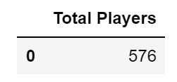
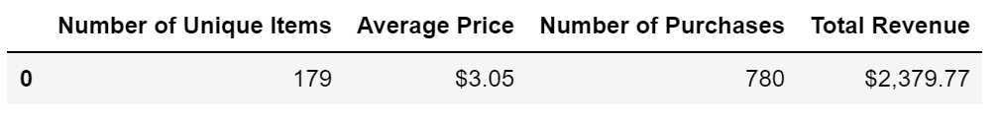
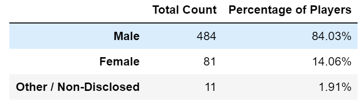
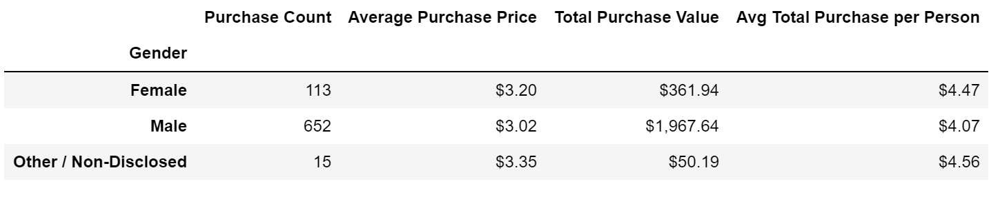
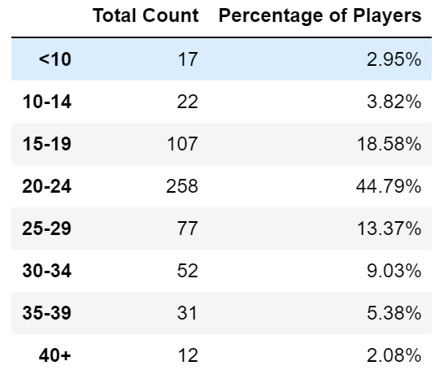
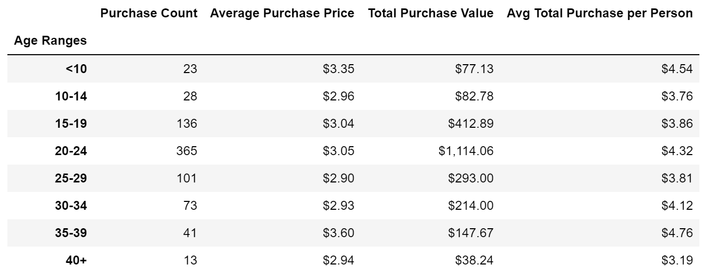
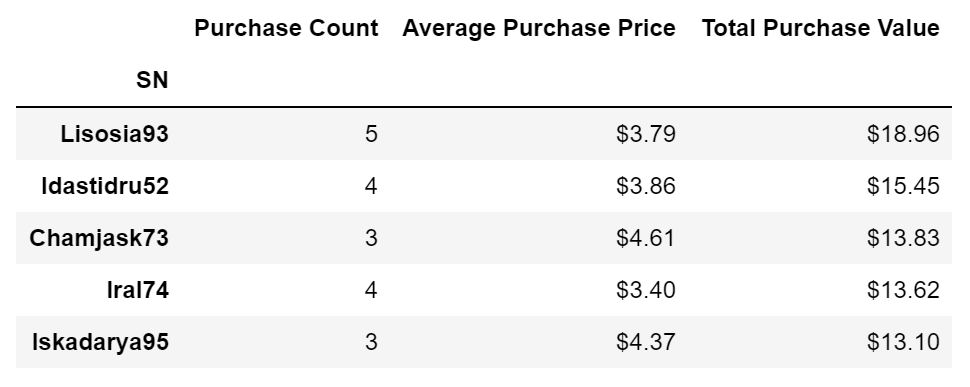
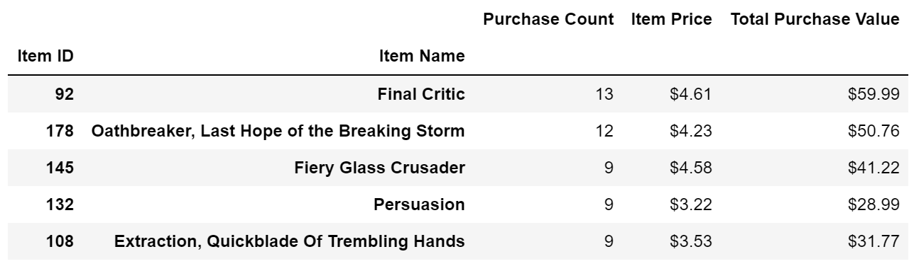

# Heroes Of Pymoli Purchasing Analysis

###### This project is a complete data analysis of the most recent fantasy game "Heroes of Pymoli". A tabular analysis was generated in order to breaks down the game's purchasing data into meaningful insights.
###### The following DataFrames shows the main results:

### Total Players

### Total Purchasing Analysis

### Gender Analysis

### Purchasing Analysis by Gender

### Players "Age" Analysis

### Purchasing Analysis by Age

### Top Spenders Analysis

### Most Popular Items Analysis

### Most Profitable Items Analysis

###### As conclusions:

###### 1. Males are the predominate Gender of Heroes Of Pymoli Game, represented by a 84% of the 576 total players. Females represents a minor population, represented by a 14%.
###### 2. People that are more than 40 years are not too interested in Heroes Of Pymoli Game; according to the "Age Demographics Analysis" this population represents only the 2.08% of the total players. Aversely, people between 20 an 24 years are the most popular players, representing 44.70% of the total players.
###### 3. Of the 780 purchased items, the Top 5 most popular items(features) were: "Final Critic" with 13 purchases, "Oathbreaker-Last Hope of the Breaking Storm" with 12 purchases, and "Fiery Glass Crusader", "Persuation, Extraction-Quickblade Of Trembling Hands" with 9 purchases.

